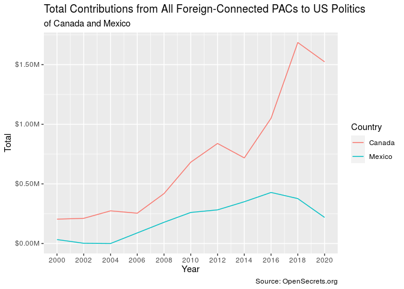
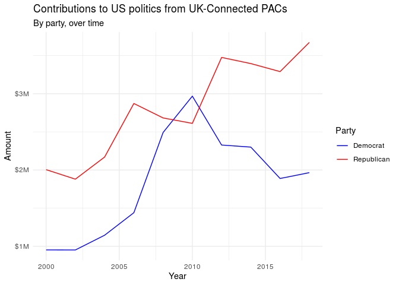

HW 03 - Money in politics
================
Yongxin Guo
2020-12-14

### Load packages

``` r
library(tidyverse)
library(scales)
```

### Ex. 1

#### Code

``` r
pac_all <- read_csv("data/pac-all.csv")
```

    ## 
    ## ── Column specification ────────────────────────────────────────────────────────
    ## cols(
    ##   name = col_character(),
    ##   country_parent = col_character(),
    ##   total = col_character(),
    ##   dems = col_character(),
    ##   repubs = col_character(),
    ##   year = col_double()
    ## )

#### Narrative

This data frame contains 2151 observations and 6 variables.

### Ex. 2

#### Code

``` r
pac_all <- pac_all %>% 
  separate(country_parent, into = c("country", "parent"), sep = "/", extra = "merge")
```

``` r
pac_all
```

    ## # A tibble: 2,151 x 7
    ##    name                      country    parent        total  dems   repubs  year
    ##    <chr>                     <chr>      <chr>         <chr>  <chr>  <chr>  <dbl>
    ##  1 7-Eleven                  Japan      Ito-Yokado    $8,500 $1,500 $7,000  2000
    ##  2 ABB Group                 Switzerla… Asea Brown B… $46,0… $17,0… $28,5…  2000
    ##  3 Accenture                 Bermuda    Accenture plc $75,9… $23,0… $52,9…  2000
    ##  4 ACE INA                   UK         ACE Group     $38,5… $12,5… $26,0…  2000
    ##  5 Acuson Corp (Siemens AG)  Germany    Siemens AG    $2,000 $2,000 $0      2000
    ##  6 Adtranz (DaimlerChrysler) Germany    DaimlerChrys… $10,5… $10,0… $500    2000
    ##  7 AE Staley Manufacturing … UK         Tate & Lyle   $24,0… $10,0… $14,0…  2000
    ##  8 AEGON USA (AEGON NV)      Netherlan… Aegon NV      $58,2… $10,5… $47,7…  2000
    ##  9 AIM Management Group      UK         AMVESCAP      $25,0… $10,0… $15,0…  2000
    ## 10 Air Liquide America       France     L'Air Liquid… $0     $0     $0      2000
    ## # … with 2,141 more rows

### Ex. 3

#### Code

``` r
parse_currency <- function(x){
  x %>% 
    str_remove("\\$") %>% 
    str_remove_all(",") %>% 
    as.numeric
}

pac_all_clean <- pac_all %>% 
  mutate(
    total = parse_currency(total),
    dems = parse_currency(dems),
    repubs = parse_currency(repubs)
  )
```

``` r
pac_all_clean
```

    ## # A tibble: 2,151 x 7
    ##    name                        country   parent         total  dems repubs  year
    ##    <chr>                       <chr>     <chr>          <dbl> <dbl>  <dbl> <dbl>
    ##  1 7-Eleven                    Japan     Ito-Yokado      8500  1500   7000  2000
    ##  2 ABB Group                   Switzerl… Asea Brown Bo… 46000 17000  28500  2000
    ##  3 Accenture                   Bermuda   Accenture plc  75984 23000  52984  2000
    ##  4 ACE INA                     UK        ACE Group      38500 12500  26000  2000
    ##  5 Acuson Corp (Siemens AG)    Germany   Siemens AG      2000  2000      0  2000
    ##  6 Adtranz (DaimlerChrysler)   Germany   DaimlerChrysl… 10500 10000    500  2000
    ##  7 AE Staley Manufacturing (T… UK        Tate & Lyle    24000 10000  14000  2000
    ##  8 AEGON USA (AEGON NV)        Netherla… Aegon NV       58250 10500  47750  2000
    ##  9 AIM Management Group        UK        AMVESCAP       25000 10000  15000  2000
    ## 10 Air Liquide America         France    L'Air Liquide…     0     0      0  2000
    ## # … with 2,141 more rows

### Ex. 4

#### Code

``` r
pac_all_clean %>% 
  filter(country %in% c("Canada", "Mexico")) %>% 
  group_by(country, year) %>% 
  summarise(total_all = sum(total)) %>% 
  ggplot(mapping = aes(x = year,
                       y = total_all,
                       group = country,
                       color = country)) +
  geom_line() +
  labs(x = "Year",
       y = "Total",
       color = "Country",
       title = "Total Contributions from All Foreign-Connected PACs to US Politics",
       subtitle = "of Canada and Mexico",
       caption = "Source: OpenSecrets.org") +
  scale_x_continuous(breaks = seq(2000, 2020, 2)) +
  scale_y_continuous(labels = label_dollar(scale = 0.000001, prefix = "$", suffix = "M"))
```

    ## `summarise()` regrouping output by 'country' (override with `.groups` argument)

<!-- -->

#### Narrative

The line plot reveals that the total contributions from Canadian PACs to
US politics was always significantly more than the total contributions
from Mexico over the period from 1998 to 2020. Also, the general trend
of total contributions to US politics, from PACs in both Canada and
Mexico, the only two adjacent countries to the USA, have showed an
increasing trend overall.

### Ex. 5

#### Code

``` r
pac_all_uk <- pac_all_clean %>% 
  filter(
    country == "UK",
    year < 2020
    ) %>% 
  group_by(year) %>% 
  summarise(
    Democrat = sum(dems),
    Republican = sum(repubs)
  ) %>% 
  pivot_longer(
    cols = c(Democrat, Republican),
    names_to = "party",
    values_to = "amount"
    )
```

    ## `summarise()` ungrouping output (override with `.groups` argument)

``` r
pac_all_uk %>% 
  ggplot(aes(x = year,
             y = amount,
             color= party)) +
  geom_line() +
  labs(x = "Year",
       y = "Amount",
       color = "Party",
       title = "Contributions to US politics from UK-Connected PACs",
       subtitle = "By party, over time") +
  scale_y_continuous(labels = label_dollar(scale = 0.000001, 
                                           prefix = "$", 
                                           suffix = "M")) +
  scale_color_manual(values = c("blue", "red")) +
  theme_minimal()
```

<!-- -->

#### Narrative

The graph reveals that the total contributions to US Republican Party
from UK-connected PACs have been generally increasing over years from
1998 to 2020. However, this is a mpre complicated trend to US Democratic
Party. The total contributions from UK-connected PACs to Democrat was
increasing over the years from 1998 to 2010, and then cchanged to a
decreasing trend over the years from 2010 to 2020.
